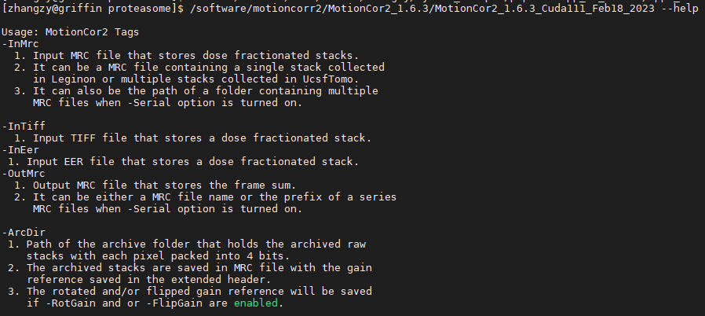
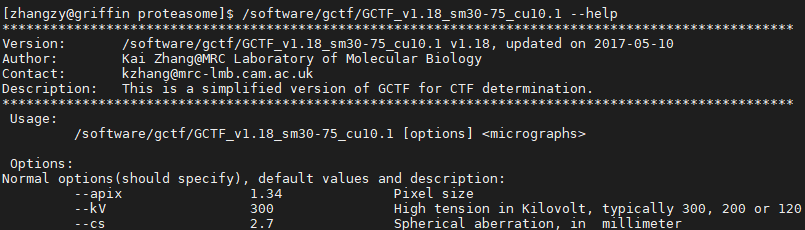
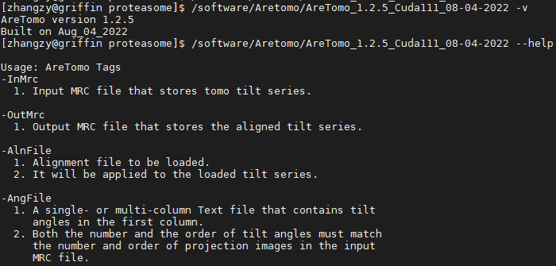
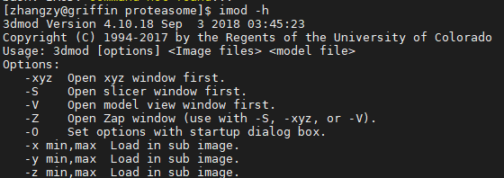
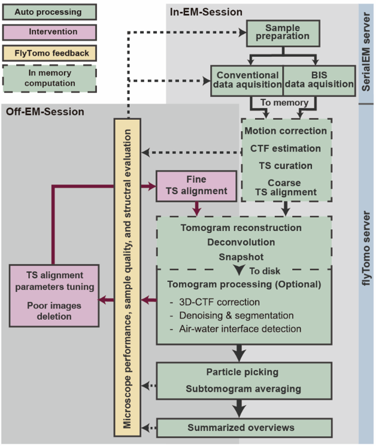
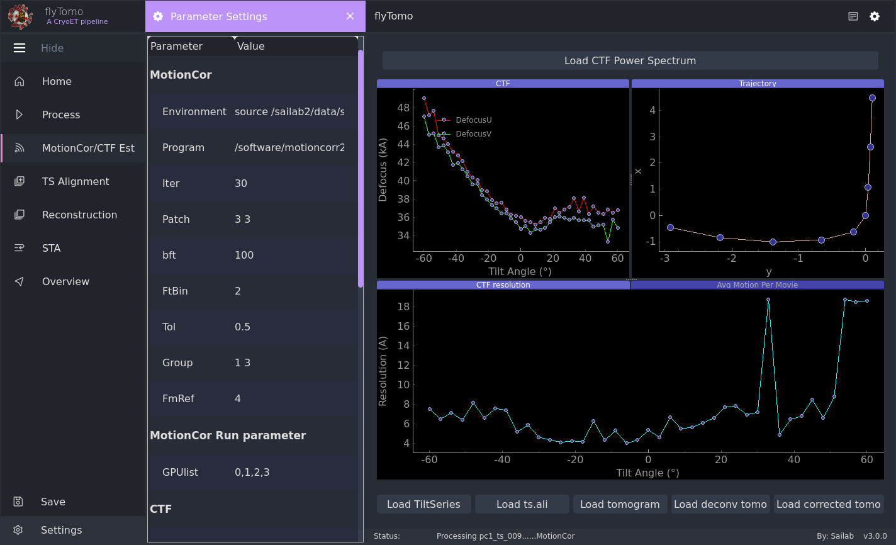

# FlyTomo User Guide (Release Build)

## Table of Contents
- [FlyTomo User Guide (Release Build)](#flytomo-user-guide-release-build)
  - [Table of Contents](#table-of-contents)
  - [1. Introduction](#1-introduction)
    - [1.1. What is FlyTomo?](#11-what-is-flytomo)
    - [1.2. Target Audience and Scope](#12-target-audience-and-scope)
    - [1.3. System Requirements](#13-system-requirements)
  - [2. Quick Start](#2-quick-start)
    - [2.1. Installation and Setup](#21-installation-and-setup)
    - [2.2. Tutorial: Your First End-to-End Run](#22-tutorial-your-first-end-to-end-run)
  - [3. Core Concepts \& GUI Walkthrough](#3-core-concepts--gui-walkthrough)
    - [3.1. FlyTomo Workflow Overview](#31-flytomo-workflow-overview)
    - [3.2. GUI Main Interface](#32-gui-main-interface)
    - [3.3. Configuration File in Detail (`FlyTomo.cfg`)](#33-configuration-file-in-detail-flytomocfg)
  - [4. Advanced Topics](#4-advanced-topics)
    - [4.1. Alignment Quality Control](#41-alignment-quality-control)
      - [4.1.1. Level 1: Initial Check with Overlap Graph and Aligned Tilt-Series](#411-level-1-initial-check-with-overlap-graph-and-aligned-tilt-series)
      - [4.1.2. Level 2: Detailed Check of Alignment Quality](#412-level-2-detailed-check-of-alignment-quality)
      - [4.1.3. Level 3: Verify Vertical Centering (Z-Shift)](#413-level-3-verify-vertical-centering-z-shift)
      - [4.1.4. Alignment Refinement for Marker-Free Data](#414-alignment-refinement-for-marker-free-data)
    - [4.2. Template Matching (PyTom)](#42-template-matching-pytom)
      - [4.2.1. Configuration and Running from GUI](#421-configuration-and-running-from-gui)
      - [4.2.2. Outputs](#422-outputs)
    - [4.3. Subtomogram Averaging (Dynamo \& RELION)](#43-subtomogram-averaging-dynamo--relion)
      - [4.3.1. Using Dynamo](#431-using-dynamo)
      - [4.3.2. Generating RELION Input Files](#432-generating-relion-input-files)
      - [4.3.3. Outputs and Quality Control](#433-outputs-and-quality-control)
  - [5. Reference](#5-reference)
    - [5.1. Command-Line Interface (CLI) Reference](#51-command-line-interface-cli-reference)
    - [5.2. Troubleshooting \& FAQ](#52-troubleshooting--faq)
    - [5.3. Best Practices \& Performance Tuning](#53-best-practices--performance-tuning)
    - [5.4. Known Limitations](#54-known-limitations)
    - [5.5. Acknowledgements](#55-acknowledgements)
      - [5.5.1. External Scientific Software](#551-external-scientific-software)
      - [5.5.2. Core Python Libraries](#552-core-python-libraries)
      - [5.5.3. Code and Concepts Adapted from Open-Source Projects](#553-code-and-concepts-adapted-from-open-source-projects)

---

## 1. Introduction

### 1.1. What is FlyTomo?

`FlyTomo` is designed as a powerful **automation platform**, not a replacement for the excellent scientific software it integrates. Its primary goal is to streamline the cryo-ET workflow by managing data, chaining processes, and providing a unified interface for monitoring and quality control. The heavy lifting of motion correction, CTF estimation, alignment, and reconstruction is performed by the specialized external tools you configure.

### 1.2. Target Audience and Scope

This guide is intended for **absolute beginners**. The scope is to run the compiled application from the “dist/” folder to complete a typical tomography workflow (from raw tilt-series to reconstruction and post-processing) with minimal setup.

### 1.3. System Requirements

- **Operating System**: Linux x86_64 (CentOS 7 or CentOS 8 or compatible)
- **CPU**: 8+ physical cores
- **RAM**: 384 GB tested for the case
- **GPU**: NVIDIA GPU, 16 GB+ VRAM recommended (multi-GPU supported)
- **Drivers/CUDA**: versions compatible with your external tools (e.g., MotionCor2, AreTomo, NovaCTF, Gctf; CUDA 11.x+ recommended)
- **Storage**: NVMe SSD strongly recommended to load raw movies; optional tmpfs for temporary directory to speed up I/O
- **Display**: X11 desktop if using GUI
- **Shell**: Bash

> **Tip**: GUI “acceleration/tmpfs” options are available.

---

## 2. Quick Start

### 2.1. Installation and Setup

**1) Unpack the release**  
Extract the archive to any directory. You should see an executable named “FlyTomo”.

**2) Make it executable**
- Open a terminal in that directory:
  - `chmod +x ./FlyTomo`

**3) Install external tools (required, installed by you)**
FlyTomo orchestrates these tools via a config file. Install the ones you need and ensure their commands are available or can be referenced by absolute paths:
- MotionCor2 (motion correction, v1.6.3 tested)
- Gctf (CTF estimation, v1.18 tested)
- AreTomo (tilt-series alignment, v1.3.4 tested)
- IMOD (includes batchruntomo; IMOD-based alignment/reconstruction, v4.11.24 tested, JAVA env also need by IMOD GUI)
- NovaCTF (tomo CTF correction/reconstruction, optional)
- IsoNet (deconvolution/denoising; often via a separate Python env, optional, v0.2 tested)
- MemBrainSeg (membrane segmentation, optional)
- PyTom (template matching, optional)
- Dynamo (STA, optional, v1.1.532 tested)

**4) Perform Quick Checks**
Verify that the external tools are installed and accessible from your terminal.
- `MotionCor2 --help `
- `Gctf --help`
- `AreTomo -v`
- `imod -h`
- `novaCTF` (or the binary name you installed)
- `membrane --help`

<div style="text-align: center; margin-bottom: 24px;">
  <figure style="margin:auto; width:70%;">
    
    <figcaption style="font-size:0.9em; color:#555;">MotionCor2 — successful help output (command: <code>MotionCor2 --help</code>).</figcaption>
  </figure>
</div>
<div style="text-align: center; margin-bottom: 24px;">
  <figure style="margin:auto; width:70%;">
    
    <figcaption style="font-size:0.9em; color:#555;">Gctf — successful help output (command: <code>Gctf --help</code>).</figcaption>
  </figure>
</div>
<div style="text-align: center; margin-bottom: 24px;">
  <figure style="margin:auto; width:70%;">
    
    <figcaption style="font-size:0.9em; color:#555;">AreTomo — version check (command: <code>AreTomo -v</code>).</figcaption>
  </figure>
</div>
<div style="text-align: center; margin-bottom: 24px;">
  <figure style="margin:auto; width:70%;">
    
    <figcaption style="font-size:0.9em; color:#555;">IMOD — help output (command: <code>imod -h</code>).</figcaption>
  </figure>
</div>

### 2.2. Tutorial: Your First End-to-End Run

For a detailed, step-by-step tutorial using a sample dataset, please refer to the **[quick_start.md](quick_start.md)** guide. It provides a complete walkthrough from data preparation to final results and is the recommended starting point for all new users.

The quick start guide covers:
- Downloading and setting up sample data.
- Creating a project and configuring `FlyTomo.cfg`.
- Running the pipeline via the GUI.
- Understanding the output file structure.

---

## 3. Core Concepts & GUI Walkthrough

### 3.1. FlyTomo Workflow Overview

FlyTomo streamlines the entire cryo-ET pipeline, from raw movie frames to a final 3D structure. The key processing stages are:

- **Mdoc → Star**: Converts `.st.mdoc` metadata into a consolidated `.star` file, providing per-tilt angles, exposure order and grouping information. This `.star` file is then used by downstream steps (motion correction, CTF estimation, tilt-series alignment, tomogram reconstruction and subsequent template matching/STA export) so that all stages share a consistent description of the tilt geometry and acquisition conditions.
- **Motion correction (MotionCor2)**: Aligns raw frames to produce per-tilt corrected images and generates stacks (`.st`).
- **CTF estimation (Gctf)**: Estimates defocus/astigmatism and CTF resolution across tilts.
- **Tilt-series alignment (AreTomo or IMOD)**: Computes transforms to register all tilts into a consistent geometry.
- **Tomogram reconstruction / CTF correction (NovaCTF)**: Reconstructs volumes, optionally with phase-flipping/CTF correction.
- **Deconvolution / Enhancement (IsoNet)**: Restores contrast and improves interpretability.
- **Template Matching (PyTom)**: Scans reconstructed tomograms to find instances of a known structure.
- **Subtomogram Averaging (STA, Dynamo)**: Extracts, aligns, and averages sub-volumes to produce a high-resolution 3D structure.

<div style="text-align: center;">
  <figure style="margin: auto; width: 60%;">
    
    <figcaption style="font-size:0.9em; color:#555;">Figure: The streamlined data processing workflow in FlyTomo.</figcaption>
  </figure>
</div>

### 3.2. GUI Main Interface

1) **Launch**  
- Run `./FlyTomo` with no subcommand. 

2) **First-time setup**
- Select the working directory (which must contain `FlyTomo.cfg`).
- In **Settings**, configure external tool paths and runtime options (threads, GPUs, tmpdir). The GUI keeps the config file in sync.
<div style="text-align: center;">
  <figure style="margin:auto;">
    
    <figcaption style="font-size:0.9em; color:#555;">Figure: FlyTomo settings panel.</figcaption>
  </figure>
</div>

3) **Source data**
- Set the source data directory (can be the same as the working directory).

4) **Monitoring**
- View progress and logs in the GUI output panel and in the per-step log files generated in your working directory.

### 3.3. Configuration File in Detail (`FlyTomo.cfg`)

The `FlyTomo.cfg` file is the central configuration for your project. A template can be generated with `./FlyTomo prepare`.

- **Program Paths and Environments**
  - `Program.<tool>`: The executable path or command name (e.g., `AreTomo` or `/usr/local/bin/AreTomo`).
  - `Environment.<tool>`: A command to set up the environment before running the program (e.g., `source /path/to/imod/imod.sh`). This is crucial for tools like IMOD, IsoNet, or PyTom that require specific Conda environments or setup scripts. The command in this field is executed *before* the `Program.<tool>` command.

- **Runtime Options**
  - `Threads`: Number of CPU threads.
  - `GPUs`: GPU IDs (e.g., `0` or `0,1`).
  - `tmpdir`: Path for temporary files (use a tmpfs like `/dev/shm` for speed if you have enough RAM).

- **Per-tool Parameters**
  - The configuration file contains sections for each external tool where you can set specific parameters (e.g., pixel size, patch sizes). For a detailed explanation and setup of these parameters, please refer to the **[cfg_tutorial.md](cfg_tutorial.md)** guide. This tutorial also provides parameter templates for several common sample scenarios, which serve as an excellent starting point for further optimization. For advanced options, always consult the official documentation of each respective tool.

> **Important:** It is strongly recommended to manually review all parameters in the `FlyTomo.cfg` file before launching a run. The GUI provides access to common settings, but does not expose all advanced options available in the configuration file.

---

## 4. Advanced Topics

### 4.1. Alignment Quality Control

Achieving a high-resolution reconstruction is critically dependent on the accuracy of the tilt-series alignment. `FlyTomo` provides a hierarchical set of tools to evaluate and refine the alignment, from initial automated checks to detailed manual inspection.

The quality control process can be broken down into several levels:

1.  **Initial Check (Overlap Graph)**: Use `FlyTomo`'s graphical feedback to quickly identify major alignment errors.
2.  **Detailed Check (Fiducial Tracks & Tomogram)**: Inspect fiducial marker behavior and the reconstructed tomogram for more subtle issues.
3.  **Centering Check (Z-Shift)**: Ensure the region of interest is correctly centered in the final volume.

#### 4.1.1. Level 1: Initial Check with Overlap Graph and Aligned Tilt-Series

This is the first and most important step for quality control within the `FlyTomo` GUI.

1.  **Inspect the Overlap Graph**: After the "TS Alignment" step, `FlyTomo` displays an "Overlap" graph. This graph shows the shift between adjacent tilt images. Images with a very large shift will be highlighted (often in red). These are strong indicators of alignment problems.
2.  **Inspect the Aligned Tilt-Series**: If the Overlap graph indicates problematic images, visually inspect the aligned tilt-series stack (`aligned ts`).
3.  **Exclude Bad Images**: If you confirm from the Overlap visualization (or by loading and inspecting the aligned tilt-series stack) that an image is poorly aligned, you can exclude it directly in the `FlyTomo` interface. Right-click on the problematic image in the list and select **"delete"**. This marks the image for exclusion from subsequent processing.
4.  **Save and Reprocess**: After marking all problematic images, **save** the changes. Then, select the modified tilt-series and click the **"reprocess sel TS"** button. `FlyTomo` will re-run the alignment and reconstruction steps for the selected datasets, applying your corrections.

#### 4.1.2. Level 2: Detailed Check of Alignment Quality

If the Overlap metrics appear acceptable, you can proceed to a more detailed inspection. This is particularly crucial for fiducial-based or patch-tracking alignment, where quantitative metrics can guide the analysis.

1.  **Analyze Alignment Residuals (Fiducial or Patch-Tracking)**:

    The primary metrics for evaluating alignment are the **Residue Error Mean** and **Standard Deviation (SD)**. The residue error quantifies the discrepancy (in nanometers) between the predicted and observed positions of fiducial markers across the tilt-series.

    - **Residue Error Mean**: The average of all tracking errors.
      - **Interpretation**: A low mean (e.g., < 0.35 nm) indicates a globally accurate alignment model. A high mean suggests a systematic problem, such as a severely misaligned image or incorrect tilt-axis estimation.
    - **Residue Error Standard Deviation (SD)**: The variation or consistency of the errors.
      - **Interpretation**: A low SD implies uniform tracking quality. A high SD, even with an acceptable mean, points to localized problems, such as a few poorly tracked fiducials (outliers).

    | Scenario             | Mean               | SD       | Interpretation & Action                                      |
    | :------------------- | :----------------- | :------- | :----------------------------------------------------------- |
    | **✅ Excellent Alignment** | **Low** (< 0.35 nm)   | **Low**  | The model is accurate and consistent. Proceed to reconstruction. |
    | **⚠️ Localized Problems**  | **Low/Acceptable** | **High** | The average is good, but outliers exist. **Action:** Manually inspect and delete poorly tracked fiducials (e.g., on carbon film, ice contaminants) using the alignment editor. |
    | **❌ Global Problems** | **High** (> 0.35 nm)  | **High/Low** | The entire alignment model is flawed. **Action:** This is a serious issue. Investigate and exclude "bad images" (e.g., due to stage drift) or re-evaluate global parameters like the tilt-axis angle. Deleting a few fiducials will not suffice. |

2.  **Visually Inspect Fiducial Tracks**:
    *   **Launch the Alignment Editor**: From the `FlyTomo` "TS Alignment" panel, click **"Open"** for the desired tilt-series. This will launch the IMOD `etomo` interface.
    *   **Look for Poor Alignment Features**: Visually inspect the fiducial tracks. Well-aligned tracks should be smooth and consistent. Poor alignment can manifest as elliptical or distorted tracks, indicating inconsistencies.
    *   **Refine in Etomo**: If you find issues based on the residuals or visual inspection, use the tools within Etomo to manually adjust or delete poorly tracked fiducials.

3.  **Analyze the Reconstructed Tomogram**:
    *   **High-Contrast Features**: Inspect the reconstructed tomogram by scrolling through the Z-slices. Examine high-contrast features like gold beads. In a good reconstruction, they should appear crisp and round. Smearing or "ghosting" indicates alignment or reconstruction issues.
    *   **Biological Features**: For experienced users, analyzing the continuity and clarity of known biological structures (e.g., membranes, filaments) can provide deeper insights into the quality of the reconstruction.

#### 4.1.3. Level 3: Verify Vertical Centering (Z-Shift)

Proper vertical positioning of your sample is essential to avoid artifacts and ensure the most important features are included in the final volume.

1.  **Inspect Tomogram Position**: In the tomogram positioning step of Etomo, or by viewing a central X-Z or Y-Z slice of the final reconstruction, check if your Region of Interest (ROI) is centered vertically.
2.  **Adjust Z-Shift**: If the ROI is too high or low, you can conveniently correct this. `FlyTomo` provides a dedicated **"Z-Shift"** utility to directly modify this value and center your sample.
3.  **Update**: After adjusting the Z-Shift, use the **"Update"** function in `FlyTomo` to apply the changes.

#### 4.1.4. Alignment Refinement for Marker-Free Data

When using marker-free alignment methods like AreTomo, refinement relies primarily on visual inspection of the aligned stack and the resulting reconstruction, as described in steps 2 and 3 above. Good alignment results in crisp, continuous features, while poor alignment manifests as blurring, ghosting, or smearing.

### 4.2. Template Matching (PyTom)

Template matching is a crucial step for locating specific macromolecules within the reconstructed tomograms.

- **Objective**: To identify the 3D coordinates and orientations of a target particle by cross-correlating a known template structure against the tomogram volume.
- **When to Use**: After tomogram reconstruction, when you have a template structure and want to find all instances of it.

#### 4.2.1. Configuration and Running from GUI

**Prerequisites**: Ensure that tomogram reconstruction has been completed.

1.  **Configure `FlyTomo.cfg`**: Ensure the `PyTom` environment and script paths are correctly set.
    ```ini
    [tomogramprocess.programpara]
    Environment.pytomtm = source /sailab2/data/sailab/zhangzy/Python_scripts/FlyTomo_pipeline_pyside6/pytom_tm.sh
    Program.pytomtm_match = pytom_match_template.py
    Program.pytomtm_extract = pytom_extract_candidates.py
    pytomtm.template_path = 
    pytomtm.mask_path = 
    pytomtm.non_spherical_mask = 0
    pytomtm.particle_diameter = 200
    pytomtm.NumberOfParticles = 300
    ```
2.  **Navigate to the "STA" Tab**: Select this tab in the FlyTomo main window.
3.  **Select Tomograms** and set **Input Parameters** (Template File, Mask File, Particle Diameter, etc.).
4.  **Start the Process**: Click the "Run" button to start the template matching job.

#### 4.2.2. Outputs

The primary output is a particle list (often in `.star` format) for each tomogram, containing the coordinates (X, Y, Z) and orientations (rot, tilt, psi) for each detected particle. These lists are the direct input for subtomogram averaging.

### 4.3. Subtomogram Averaging (Dynamo & RELION)

STA is the final step to achieve a high-resolution 3D structure. FlyTomo supports both `Dynamo` and `RELION`.

> **Advanced Tip for `Warp&M` Users**:
> The file structure and outputs generated by FlyTomo (such as xf files and particle coordinate files) are highly compatible with other popular STA packages. For `Warp&M` (Windows version), users can readily prepare the required input files by pointing Warp to the FlyTomo output directories.

#### 4.3.1. Using Dynamo

FlyTomo orchestrates Dynamo using a dedicated configuration file, `dynamo_para.cfg`.

**1. Configuration (`dynamo_para.cfg`)**
You must customize the template with your specific paths and parameters.
```ini
[dynamo]
# Path to the Dynamo standalone activation script (with MCR)
dynamo_standalone = /path/to/your/dynamo/dynamo_activate_linux_shipped_MCR.sh
# Path to the Matlab Compiler Runtime (MCR) cache
mcr_cache_root = /path/to/your/MCR_cache

[dynamo.dtcropparams]
# The .doc file describing the tomograms to be processed
tomograms = /path/to/your/tomogram.doc
# The .tbl file containing the particle coordinates from template matching
table = /path/to/your/particle_coordinates.tbl
# Directory to save the extracted sub-volumes (particles)
target_directory = /path/to/your/particles_output
# Box size (side length in pixels) for the sub-volumes
sidelength = 32
```
> **Important**: You are responsible for creating the `.doc` and `.tbl` files with the correct format and paths required by Dynamo.

**2. Running from the GUI**
The "STA" tab in FlyTomo integrates two distinct modes:
- **Average Mode**: Quickly generates an initial average. It automatically crops subtomograms and computes a simple average. Ideal for generating a preliminary reference.
- **STA Mode**: Performs a complete, iterative alignment and averaging project. It also crops subtomograms, then proceeds with a full project as defined by your `dynamo_para.cfg`. For detailed guidance on parameters, please refer to the official **Dynamo documentation and wiki**.

To run, navigate to the "STA" tab, choose a mode, and click "Start".

#### 4.3.2. Generating RELION Input Files

FlyTomo simplifies preparing your data for RELION.
1.  **Navigate to the "STA" Tab**.
2.  **Select "Generate RELION Files"**.
3.  **Specify an Output Directory** for the `.star` files.
4.  **Click "Generate"**. FlyTomo will create a set of `.star` files ready for import into RELION.

#### 4.3.3. Outputs and Quality Control

- **Primary Output**: The final high-resolution 3D map of your particle (a `.mrc` file).
- **Quality Control**:
    - **Resolution**: Evaluate the final resolution using the Fourier Shell Correlation (FSC) curve.
    - **Visual Inspection**: Open the final map in a molecular visualization program (like UCSF ChimeraX or Coot) to check for expected structural features.

---

## 5. Reference

### 5.1. Command-Line Interface (CLI) Reference

Subcommands are provided for most processing steps. Use `--help` for details on any command.
- **Prepare default config**:
  - `./FlyTomo prepare --output_directory /path/to/work_dir`
- **Convert mdoc to star**:
  - `./FlyTomo mdoc2star --input /path/to/work_dir`
- **Motion correction (MotionCor2)**:
  - `./FlyTomo motioncor --input /path/to/tilt-series --cfg /path/to/FlyTomo.cfg`
  - Add `--batch` to run on all tilt-series in the input directory.
- **CTF estimation (Gctf)**:
  - `./FlyTomo gctf --input /path/to/work_dir_stack --cfg /path/to/FlyTomo.cfg`
- **Tilt-series alignment (AreTomo/IMOD)**:
  - `./FlyTomo tsalign --input /path/to/work_dir_stack --cfg /path/to/FlyTomo.cfg --batch`

### 5.2. Troubleshooting & FAQ

- **Cannot create/write directories**:
  - Fix permissions (e.g., `chmod -R u+rwx /data/projectA*`) or choose a writable path.
- **External tool not found / wrong version**:
  - Ensure the tool (e.g., `AreTomo`, `batchruntomo`) is on your system's `PATH` or correctly specified in `FlyTomo.cfg`.
  - For tools requiring environment activation, ensure the `Environment.<tool>` field is correctly set in the config.
- **GUI/OpenGL issues**:
  - Use a proper Linux desktop session. For remote access, configure X11 forwarding.
- **Jobs hang or run out of GPU memory**:
  - Lower parallelism (`Threads`/`GPUs` in config), reduce per-tool resource limits (e.g., patch sizes), or use a GPU with more VRAM.
- **Star file not generated from mdoc**:
  - Ensure the `.st.mdoc` file is located alongside the raw frames and run the `mdoc2star` command manually.

### 5.3. Best Practices & Performance Tuning

- **Use tmpfs**: Use a RAM disk (e.g., `/dev/shm`) for the `tmpdir` in `FlyTomo.cfg` to speed up I/O-heavy steps. Ensure you have enough RAM.
- **Fast Storage**: Keep raw and derived data folders on fast storage (NVMe SSD).
- **Configuration Snapshots**: Keep versioned snapshots of `FlyTomo.cfg` for reproducibility.
- **Resource Tuning**:
  - **Threads**: Adjust `Threads` in `[tomogramprocess.programpara]` and per-tool sections.
  - **GPUs**: Assign `GPUs=0` or `0,1` to map to MotionCor2, Gctf, Dynamo, etc.

### 5.4. Known Limitations

- The GUI requires a working X11 desktop environment.
- External tool versions may change their options; ensure command lines in the config are valid for your specific versions.
- Some features expect IMOD-standard outputs (e.g., `ctffind4.txt`, `.xf`, `.rawtlt`) for downstream steps.

### 5.5. Acknowledgements

`FlyTomo` is built upon the shoulders of giants. We extend our sincere gratitude to the developers of the essential third-party programs and the vibrant open-source community that makes projects like this possible.

#### 5.5.1. External Scientific Software

The core scientific processing is performed by these state-of-the-art external tools. `FlyTomo` acts as an orchestrator to streamline their use in a high-throughput workflow.

- **Motion Correction**: MotionCor2
- **CTF Estimation**: Gctf, CTFFIND4
- **Tilt-Series Alignment & Reconstruction**: AreTomo, IMOD
- **Advanced Reconstruction**: NovaCTF
- **Denoising**: IsoNet
- **Subtomogram Averaging**: PyTom, Dynamo

#### 5.5.2. Core Python Libraries

The `FlyTomo` interface, data handling, and internal logic are built with the following key Python libraries :

- **GUI Framework**: `PySide6` for the modern and responsive user interface.
- **Numerical Computing**: `NumPy` and `SciPy` form the backbone of all numerical operations.
- **Data Handling**:
    - `pandas` is used for organizing and manipulating tabular data.
    - `starfile` provides robust reading and writing capabilities for the RELION `.star` file format.
    - `mrcfile` is essential for reading and writing `.mrc` / `.st` files, the standard format for image stacks and volumes in cryo-ET.
- **Visualization**: `Matplotlib` and `pyqtgraph` are used for generating the various plots and graphs for quality control within the GUI.

#### 5.5.3. Code and Concepts Adapted from Open-Source Projects

We gratefully acknowledge the foundational work of several open-source projects that have significantly influenced the design and development of `FlyTomo`.

-   **`teamtomo`**: Several modules in `FlyTomo` are based on or have been adapted from their outstanding open-source contributions. Beyond the core logic for automated tilt-series alignment, we have also learned a great deal from their approaches to file parsing, data management, and process handling.

-   **`Warp/M`**, **`AreTomo3`**, **`Dynamo`**, and **`emClarity`**: We have also drawn inspiration and learned valuable concepts from the architecture and implementation of other leading software in the cryo-ET field, including `Warp/M`, `AreTomo3`, `Dynamo`, and `emClarity`. Their contributions to solving complex challenges in tomogram reconstruction and subtomogram averaging have been invaluable to the community and to the development of this project.
