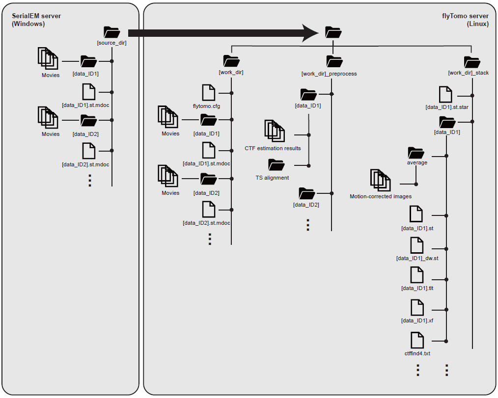
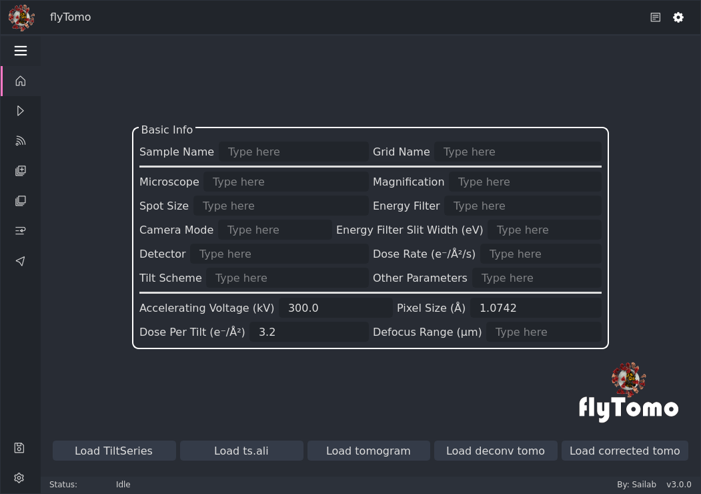
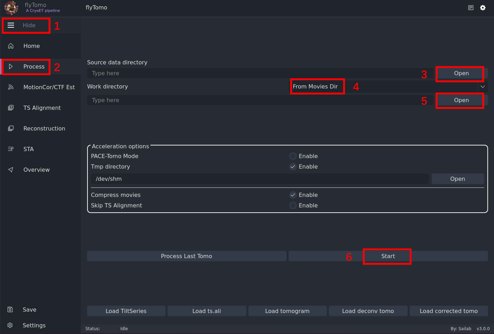
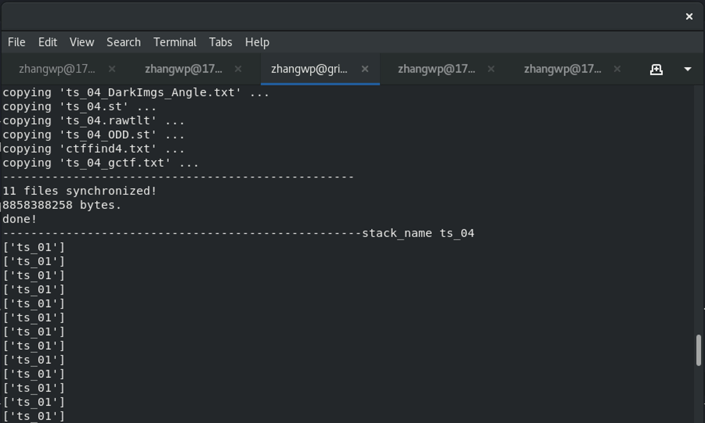
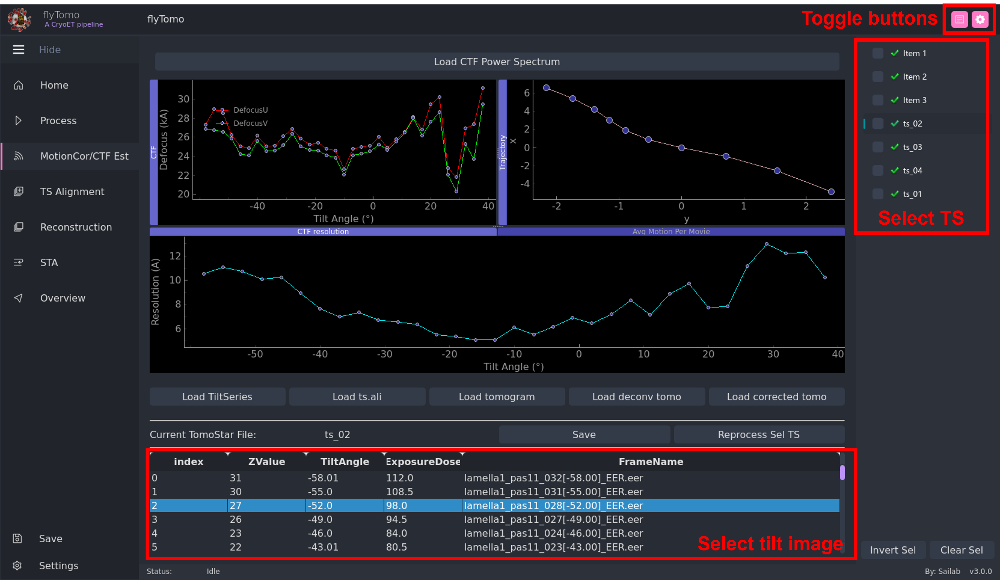
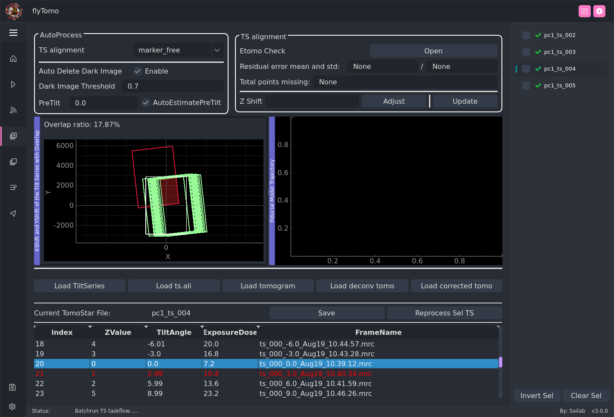

# Quick Start

Goal: run one dataset end-to-end as fast as possible.

`FlyTomo` supports both on-the-fly and offline processing, via CLI or a user-friendly GUI. It automatically preprocesses raw movies through tilt-series alignment. Downstream steps—3D CTF correction, denoising, segmentation, particle picking, and subtomogram averaging—are available but out of scope for this quick run.

This guide walks through a sample lamella dataset of S. cerevisiae with a minimal, streamlined flow.

---

## 1. File Hierarchy

Before starting the tutorial, one should get to know the `FlyTomo` file organization in advance to better understand the logics of `FlyTomo`.

- Source data directory 
  The folder that contains the raw data directly from the EM is named 'source data directory', which is usually stored in an independent server that monitors the EM. Users are encouraged to organize the raw movies following Fig. 1 to meet the requirement of `FlyTomo`. That is, all the movies belong to the same tilt series (TS) should be deposited in a seperate folder under the source data directory (let's say `./data_ID1`, for example). If the raw data is collected by `SerialEM` or compatibly, an `.mdoc` file recording the metadata of a dataset is required, which should **rigorously following the naming convention**, *i.e.*, `./data_ID1.st.mdoc`.

- Work directory
  The work directory is the primary folder for data processing and the final destination for raw data storage. For on-the-fly processing, raw movies are transferred from the source data directory to the work directory (with optional lossless compression). For offline data (e.g., from EMPIAR or a local server), this directory is where you place your dataset to begin with. All processing is launched from here.

- Derived Directories
  During processing, `FlyTomo` creates two main output directories in the parent folder of the work directory. This separation is designed to distinguish between transient intermediate files and stable, final outputs.
  - `[work_dir]_preprocess`: This directory stores intermediate results that may be frequently updated or adjusted during processing. This includes files like alignment parameters, reconstruction files, and other temporary files. Think of it as a "scratch" space for calculations in progress.
  - `[work_dir]_stack`: This directory holds the final, stable outputs of the preprocessing pipeline. It contains the aligned tilt-series stacks, `.star` files with all metadata, and other crucial results ready for downstream analysis (like reconstruction, segmentation, or subtomogram averaging).



**Figure 1. The file hierarchy of a typical `FlyTomo` project**
<br>

>**Design Philosophy**: This structure is intentionally designed for modern on-the-fly data workflows. A common scenario is running `FlyTomo` on a processing server that monitors an acquisition computer running `SerialEM`. As `FlyTomo` processes the incoming data, it populates the `_preprocess` and `_stack` directories. Once preprocessing is complete, only the relatively small `[work_dir]_stack` folder needs to be transferred to a different server or powerful GPU cluster for downstream analysis (like subtomogram averaging). This avoids having to copy the entire raw dataset or the large intermediate files, saving significant storage space and network bandwidth.


## 2. Install Check + Get Sample Data

We assume `FlyTomo` is installed and first-time configuration is done. If not, see [`FlyTomo` installation](./installation.md).

Quick check (adjust the path as needed):

```shell
/path/to/flytomo/installation/folder/flytomo --help
```
You will see the output:
```shell
usage: flytomo [-h] [--cfg CFG] {prepare,mdoc2star,motioncor,gctf,dw,tsalign} ...

Run the pipeline

optional arguments:
  -h, --help            show this help message and exit
  --cfg CFG, -c CFG     Path to configuration file

subcommands:
  {prepare,mdoc2star,motioncor,gctf,dw,tsalign}
    prepare             Prepare the config file(flytomo.cfg)
    mdoc2star           mdoc2star: Convert mdoc to star
    motioncor           motioncor: From Movie to Stack
    gctf                CTF Measurement: Gctf
    dw                  Dose Weighting
    tsalign             TS Alignment

```
To shorten the command to activate `FlyTomo`, we make an PATH to the directory of `FlyTomo`:
```shell
export PATH=/path/to/flytomo/installation/folder/:$PATH
flytomo --help
```

Download the demo set of cryo-FIB-milled S. cerevisiae lamellae: 
**[Download link (placeholder)](somewhere_to_link)**

Assume the dataset is placed under `/path/to/data/yeast` with the following layout:

```
/path/to/data/yeast
    |-flytomo_tutorial.cfg
    |-ts_01.st.mdoc
    |-ts_01
    |   |-some movies here...
    |-ts_02.st.mdoc
    |-ts_02
    |   |-some movies here...
    |-ts_03.st.mdoc
    |-ts_03
    |   |-some movies here...
    |-ts_04.st.mdoc
    |-ts_04
    |   |-some movies here...
```

> Note: `FlyTomo` accepts MRC/TIFF/EER. Registration depends on the `.st.mdoc` file next to the raw frames folder; names need not start with "ts_" as long as the `.st.mdoc` matches.

## 3. Create a Project and Prepare the Config
For simplicity, the work directory equals the source data directory (see section 1).

Let's enter the data folder we store the downloaded *S. cerevisiae* dataset. This is just the work directory for our tutorial:
```shell
cd /path/to/data/yeast
```
To ensure a valid project, create or copy a `FlyTomo` configuration file before starting `FlyTomo`. Use the built-in default template:
```shell
flytomo prepare
```
Completing the command will create a `flytomo.cfg` in the current folder. Alternatively, copy your own config into the work directory.
(The file is generated automatically from FlyTomo's built-in template: section names and example keys are pre-filled, but paths to external programs, environment activation commands, and data-specific parameters are *not* guessed for you and must be reviewed and edited manually. Advanced users may instead copy an existing, well-tested config into the work directory.)

Next, open and edit `flytomo.cfg` using any text editor.
Fill in external program paths and optional environment activation lines. Typical keys in the template:
- `Program.<tool>`: absolute path or command name
- `Environment.<tool>`: a shell snippet to source an environment before running the tool (optional)
- runtime options: threads, GPU list, temporary directory, etc.

Example (illustrative; tailor to your paths):
```ini
[tomogramprocess.programpara]
Threads=8
GPUs=0
tmpdir=/dev/shm/flytomo_tmp

Environment.novactf=source /opt/envs/novaCTF_env.sh
Program.novactf=/opt/novaCTF/bin/novaCTF

Environment.isonet=source /opt/envs/isonet_env.sh
Program.isonet=/opt/miniconda/envs/isonet/bin/python /opt/IsoNet/bin/isonet.py

Environment.membraneseg=source /opt/envs/membraneseg_env.sh
Program.membraneseg=membraneseg

Environment.batchruntomo=source /opt/imod/IMOD-linux.sh
Program.batchruntomo=batchruntomo
```

Keep it simple: make sure each tool you intend to use runs successfully in your shell first, then mirror that setup in `flytomo.cfg`.

For other fields, set parameters suitable for your data. In this tutorial, recommended parameters are available in `flytomo_tutorial.cfg`.

To launch the `FlyTomo` GUI:
```shell
flytomo
```
`FlyTomo` reads `flytomo.cfg` in the current directory by default. To specify another file:
```shell
flytomo --cfg /path/to/any_name.cfg
```
You should now see the `FlyTomo` home page.

**Figure 2. Homepage of `FlyTomo`**
<br>
## 4. Data Preprocessing

## 4.1 Start the Run
Follow the six steps below (numbers correspond to Figure 3) to initiate preprocessing:
```none
1. If the left panel is hidden, click the "Hide" button (1) to toggle the side menu.
2. Click the ▶️ Process icon on the left panel (2).
3. For "Source data directory", click "Open" (3) and select `/path/to/data/yeast`.
4. In the Type dropdown, choose "From Movies Dir" (4).
5. For "Work directory", click "Open" (5) and select `/path/to/data/yeast`.
6. Click the "Start" button (6).
```


**Figure 3. The "Process" panel of `FlyTomo`.**
<br>

"From Movies Dir" tells FlyTomo to start from raw movie folders (organized as in Section 1): it will read the `.st.mdoc` files, run motion correction and CTF estimation, and then generate new stacks into `[work_dir]_preprocess` and `[work_dir]_stack`.
"From Stack Dir" is used when stacks have already been generated by a previous run: set the source data directory to the existing stack folder (e.g. `yeast_stack`) and select this option to load and reuse those stacks as the starting point for all subsequent steps (quality checks, 3D CTF correction, denoising, segmentation, STA, etc.), entirely without accessing the original raw movies again.
 
Once started, monitor progress in the terminal and in the status bar at the bottom of the FlyTomo GUI (which reports the current step and overall state). The typical preprocessing sequence is:
- motion correction
- CTF estimation
- stack generation
- dark image removal
- dose weighting
- TS alignment

Since "PACE-Tomo Mode" is off in our use case, all the TS go through this workflow one by one until the last TS is about to be process.

### 4.2 Process the Last Tomo

Note that `FlyTomo` treats the **"Last Tomo"** cautiously. During on-the-fly processing, `FlyTomo` cannot reliably know from the file system alone whether data collection has truly finished for the most recently acquired tilt-series (more tilts or even another TS may still arrive). To avoid accidentally processing a **partially acquired** dataset, `FlyTomo` always considers the last TS (by acquisition time) as potentially incomplete and pauses the preprocessing right before it.

At this point, `FlyTomo` repeatedly reports the "Last Tomo" name in the terminal and in the GUI status bar, and waits for your decision. In our case, it is "ts_01":


```none
When you are sure that data collection for this tilt-series has finished (for example, the microscope/SerialEM has stopped, no new movie files are appearing in its folder, and you do not expect further TS to be added), click "Process Last Tomo" in the Process panel to let FlyTomo process this final, now-complete dataset.
```

## 5. Evaluate Results

### 5.1 Check Output Files
Open a new terminal, go to the parent folder of the working directory, and list the folder.
```shell
cd /path/to/data
ls
```
You may see two new folders prefixed with the name of the working folder. In this tutorial, the result of `ls` is:
```shell
yeast   yeast_preprocess  yeast_stack
```

`yeast_preprocess` stores intermediate results used for GUI feedback (e.g., motion correction, alignment outputs).

`yeast_stack` stores key downstream inputs: stacks (even/odd, dose-weighted), tilt angles, alignment transforms, CTF estimates, etc. Many are hard-linked or copied with minimal extra space.

Go to your `yeast_stack` and list the file in it:
```shell
cd ./yeast_stack
ls
```
You will see:
```shell
ts_01  ts_01.st.star  ts_02  ts_02.st.star  ts_03  ts_03.st.star  ts_04  ts_04.st.star
```
The `.st.star` file stores necessary metadata per tilt image and marks a TS as "processed" (so future runs started "From Movies Dir" will normally skip recalculating this stack). If you change preprocessing settings in `flytomo.cfg` (for example MotionCor2 patch size or dose weighting scheme, Gctf search ranges, or TS-alignment options) and want a given TS to be recomputed with these **new parameters**, delete its `.st.star` (or, to force a clean rerun of all TS, delete the entire `yeast_stack`) and then start the preprocessing again from the GUI or CLI; `FlyTomo` will regenerate the stacks and metadata using the updated configuration.

### 5.2 Check Graphical Feedback
`FlyTomo` enhances data quality feedback by providing graphs and diagrams for datasets. 

- **"MotionCor/CTF Est" panel**
In this panel, `FlyTomo` draws scattering plots for frame drifts, defocus, and CTF estimation resolution for each tilt angle. 
Expand the TS and tilt-image selectors (top-right toggles). Click a TS name (not the checkbox) to update defocus/CTF plots; select a tilt image to refresh frame-drift plots.


**Figure 4. The "MotionCor/CTF Est" panel in `FlyTomo`**
<br>
The "Load xxx" buttons open pop-up viewers for images/volumes. "Load corrected tomo" will be blank until denoising (e.g., IsoNet) is completed.

**Figure 5. The pop-up windows for image display in `FlyTomo`.** Top-left: CTF power spectrum; top-right: Aligned TS; bottom-left: Reconstructed tomogram; bottom-right: deconvolved tomogram.
<br>

- **"TS Alignment" panel**
Shows Residual Error Mean/Std and tracks for fiducial or patch-based alignment (from Etomo). In this tutorial we use AreTomo, so this panel may be blank.



### 5.3 Advanced: Alignment Quality Control

A brief checklist is provided here. For detailed steps and principles of alignment quality control, please refer to the **[Alignment Quality Control](Tutorial4.md#41-alignment-quality-control)** section in the main user guide.

- **Metrics**: Watch Residual Error Mean and Std. A high mean suggests global issues; a low mean with high Std suggests a few bad tracks.
- **Fiducial-based (IMOD/Etomo)**: Open the alignment editor, remove outlier fiducials, and if needed, exclude clearly bad images.
- **Z-shift**: Verify tomogram vertical centering in X–Z/Y–Z views; adjust the Z-shift to keep the ROI away from volume edges.
- **Marker-free (AreTomo)**: Rely on visual inspection of the aligned stack and especially the deconvolved tomogram; look for blurring, smearing, or doubling.
- **Reprocess**: After edits, click **Reprocess** in `FlyTomo` to regenerate the alignment and tomogram.

---

## 6. `FlyTomo` via Command Line (optional, advanced)

For advanced users, `FlyTomo` enables running with command lines convenient for scripting. Typing `flytomo --help` for more information.

Assume the same yeast project, common CLI goes by:

- Prepare default config:
```shell
flytomo prepare --output_directory /path/to/data/yeast
```

- Convert mdoc to star:
```shell
flytomo mdoc2star --input /path/to/data/yeast
```

- Motion correction (MotionCor2):
```shell
# Single TS:
flytomo motioncor --input /path/to/data/yeast/ts_01 --cfg /path/to/data/yeast/flytomo.cfg
# or
# Batch process the whole dataset:
flytomo motioncor --input /path/to/data/yeast --cfg /path/to/data/yeast/flytomo.cfg --batch 
```

- CTF estimation (Gctf):
```shell
flytomo gctf --input /path/to/data/yeast_stack --cfg /path/to/data/yeast/flytomo.cfg
```

- TS alignment (AreTomo/IMOD, depends on the config):
```shell
flytomo tsalign --input /path/to/data/yeast_stack --cfg /path/to/data/yeast/flytomo.cfg --batch
```

Downstream applications (NovaCTF, IsoNet, MemBrain) are typically run from the GUI. If you prefer CLI, use the tools directly with the same project layout.


---
